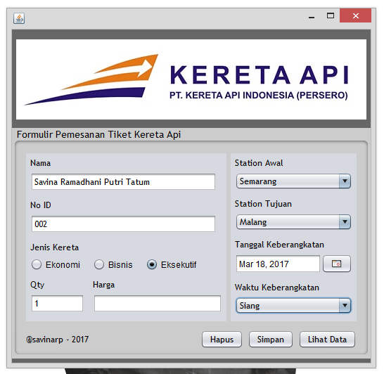

# TiketKeretaApi-UTSPBO

Nama : Savina Ramadhani Putri T 

Kelas : XIRPL3 - 31 

Nama Sekolah : SMK Telkom Malang

# Screenshoot Hasil Aplikasi

1. Halaman Login

2. Message Berhasil Sign Up

3. Setelah berhasil Sign In, akan masuk ke halaman Formulir

4. Button Simpan kita klik, muncul message Data Berhasil Ditambahkan

5. Jika button Lihat Data diklik, maka akan ke halaman selanjutnya.

6. Untuk menampilkan isi database ke dalam tabel tersebut klik button Tampilkan Database

7. Button Print - Message Data di Proses

8. Isi Database db_keretaapi

9. Isi tb_akun

10. Isi tb_tiket

